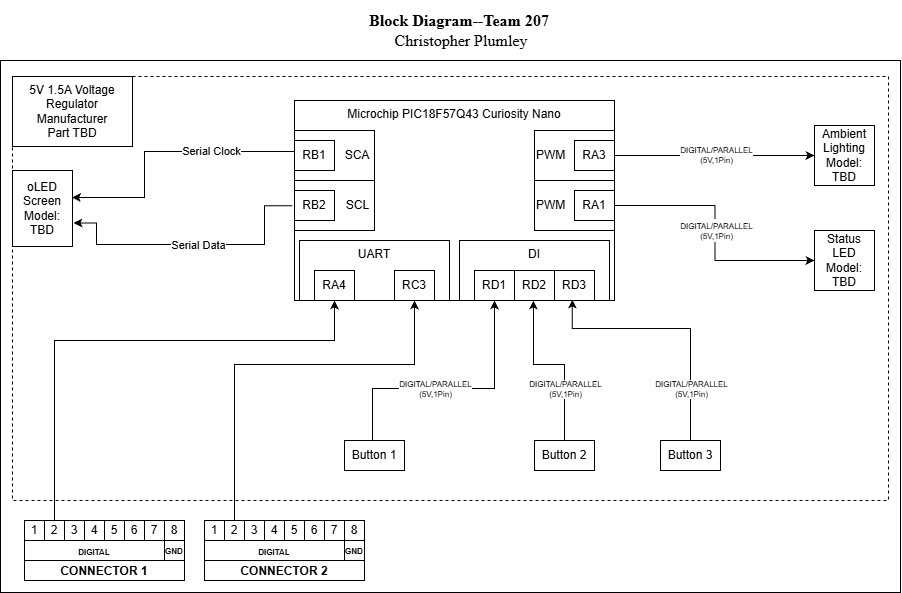

## Overview
The block diagram shows the Microchip PIC-Nano board and its associated inputs and outputs. The general purpose of this design is to receive digital values from its companion boards. The values received will be used in conjunction with user selected settings to perform a set of functions. Those functions include manipulating an oLED screen to display data and to set the conditions for the mood lighting outputs. The board runs on 5V DC as does the LED array and the oLED screen. The device has 3 push buttons that provide digital inputs to the board, which in turn provide the user with an interface to operate the device.

## Block Diagram 

